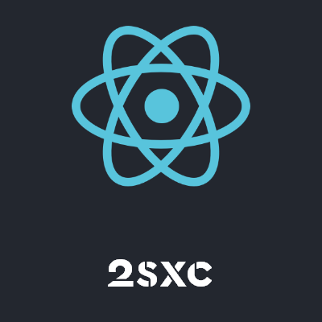

# App Template for React Best Practices with DNN and 2sxc

## What is this?

If you wish to develop React within DNN, the initial setup can be challenging. This template App solves a bunch of problems for you, such as:

1. Develop on your local system with hot-reloading as you work.
2. Use DNN and 2sxc APIs out of the box.
3. Use multiple code editions, so you can test staging code on the production server without interrupting users who see the live edition.

## Getting started

We recommend installing this App on your 2sxc first and following the steps below to gain a better understanding.

(For existing React apps, you can copy the relevant parts.)

Install this app on your 2sxc installation and run `npm install` inside the React app at `\app`.

To serve the app, run the `start` script inside the `package.json`. After selecting "local" on the edition switch, you should see the app running with live reload.

### Dependencies
